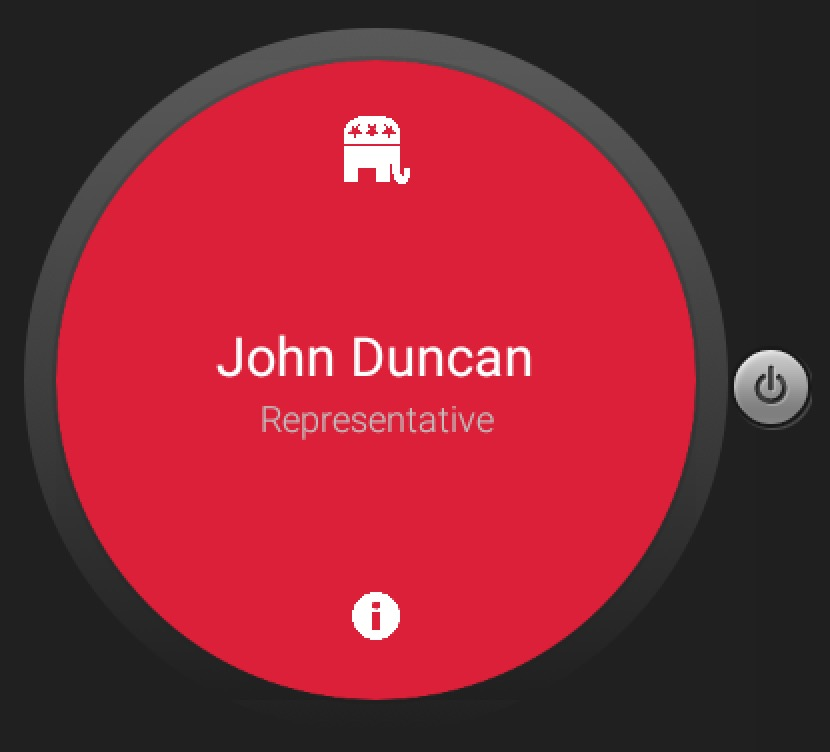
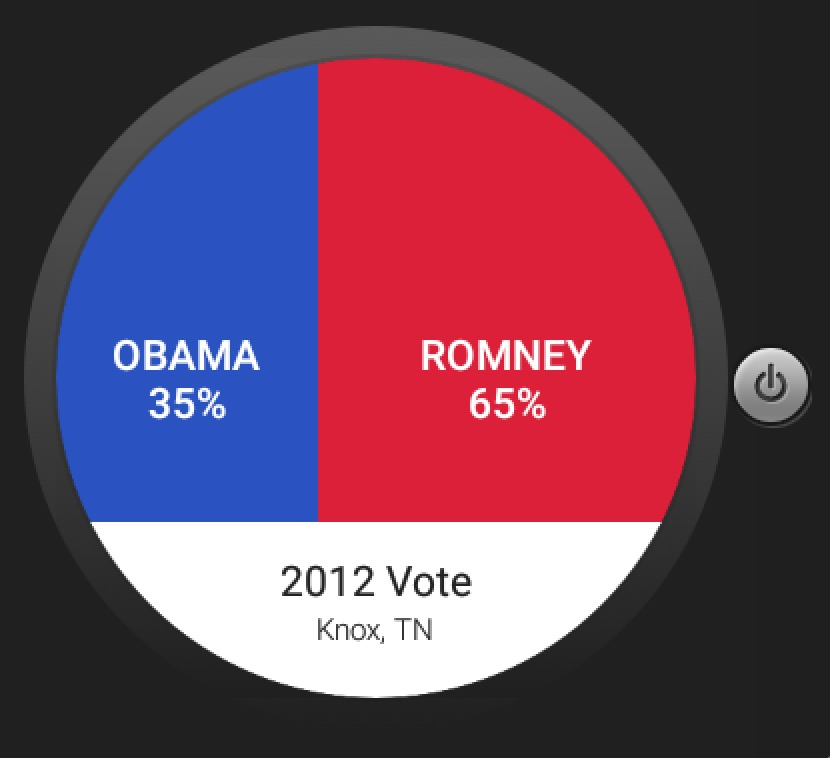

# PROG 02: Represent!

This is my Represent! app for CS160. This is the final version which includes real API calls and real data. APIs used include Twitter, Sunlight, and others.

## Authors

Hamza Ahmed ([hamza.ah@berkeley.edu](mailto:hamza.ah@berkeley.edu))

## Demo Video

See [my demo video] (https://www.youtube.com/watch?v=8j0YtjY2DNg)

## Screenshots

## Acknowledgments

* StackOverflow for tons of help + Shake Detector code
* Catnip (CS160 Staff)
