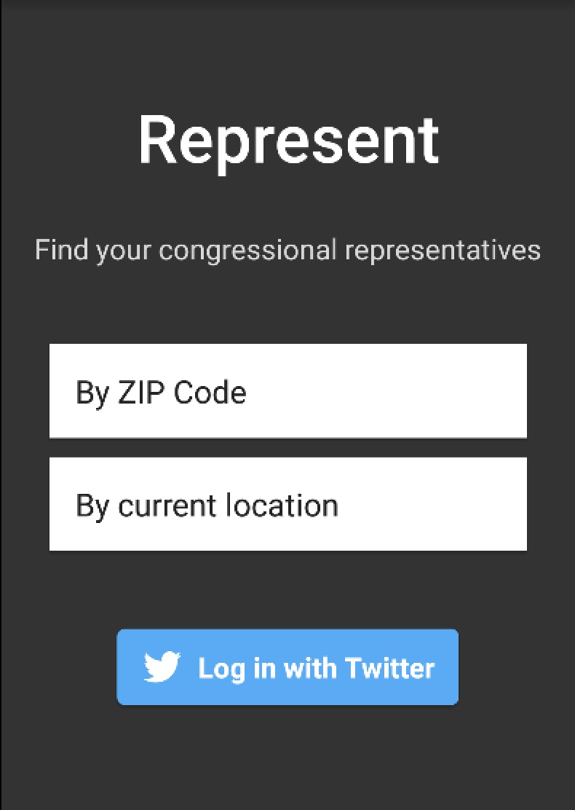

# PROG 02: Represent!

This is my Represent! app for CS160.

## Authors

Hamza Ahmed ([hamza.ah@berkeley.edu](mailto:hamza.ah@berkeley.edu))

## Demo Video

See [my demo video] (https://https://youtu.be/7xXJb1NRkIo)

## Screenshots

## Acknowledgments

* StackOverflow for tons of help + Shake Detector code
* Catnip (CS160 Staff)
